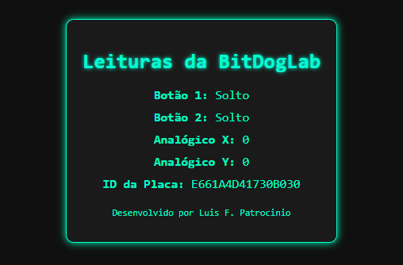

# BitDog IoT Panel 🚀

Projeto embarcado com RP2040 que cria um servidor web futurista para monitorar sensores de entrada, como botões físicos e joystick analógico, utilizando comunicação Wi-Fi via CYW43.

## 🖼️ Screenshot



## ✨ Funcionalidades

- Conexão à rede Wi-Fi com autenticação WPA2.
- Servidor HTTP local rodando na porta 80.
- Interface futurista em HTML/CSS com atualização automática a cada segundo.
- Leitura em tempo real de:

  - Botão 1 (GPIO)
  - Botão 2 (GPIO)
  - Eixo X do analógico (ADC)
  - Eixo Y do analógico (ADC)

- Identificação da placa e exibição via web.
- Link direto para o GitHub do autor na página.

## 🛠️ Tecnologias

- C com SDK do Raspberry Pi Pico
- Biblioteca `lwIP` para rede TCP/IP
- CYW43 Wi-Fi driver
- HTML e CSS para a interface web

## 📷 Interface Web

A interface apresenta um painel com visual estilo cyberpunk e leitura dos sensores atualizada automaticamente a cada 1 segundo.

## 📡 Requisitos

- Placa baseada no RP2040 com módulo Wi-Fi (ex: Raspberry Pi Pico W)
- SDK do Pico instalado
- Compilador CMake + toolchain ARM
- Acesso à rede Wi-Fi 2.4GHz

## 🚀 Como compilar

1. Clone o repositório:

   ```bash
   git clone https://github.com/seu-usuario/bitdog-iot-panel.git
   ```

2. Compile usando CMake:

   ```bash
   cd bitdog-iot-panel
   mkdir build && cd build
   cmake ..
   make
   ```

3. Envie para sua placa via UF2.

## 📄 Licença

Você pode usar e modificar este projeto livremente, mas o autor deverá ser creditado em qualquer redistribuição ou adaptação.

---

Desenvolvido com 💙 por [Patrocínio](https://github.com/luisfpatrocinio)
